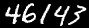

## multi-mnist
MNIST data set with multiple digits. We have generated a
dataset for multiple digits recognition task from MNIST (http://yann.lecun.com/exdb/mnist/index.html).

You can download generated data in release tab.
See in `examples` folder:

```
examples
    - train
        + labels.csv
        + 1/
        + 2/
        ...
        + 8/
        + 9/
        
    - test
        + labels.csv
        + 1/
        + 2/
        ...
        + 8/
        + 9/    
```
Each folder `1`, `2`, `3`, `4`, ..., contains generated
images with exactly number of digits as the name of folder. `labels.csv`
list name of image and ground truth number respectively.
```bash
labels.csv
1.png,1
2.png,4
3.png,45
4.png,785,
5.png,1479,
...

``` 

#### Create your own dataset

Clone this repository:
```bash
git clone https://github.com/vndee/multi-mnist
```
Requirements:

- python 3
- numpy
- idx2numpy
- tqdm
- opencv-python

Install requirements:
```bash
pip3 install -r requirements.txt
```

Change some parameter in `main.py`:

- `output_dir`: Path to your expected output directory.
- `number_of_samples_per_class`: Number of samples for each number of digit.

Run `python3 main.py` and take a look at `output_dir`.
